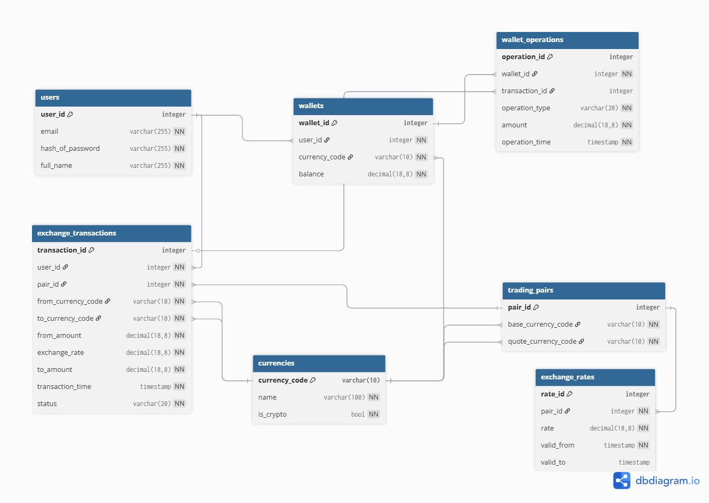

# Projekt kryptoměnové směnárny

## Databázové systémy II

**Akademický rok:** 2025/2026  
**Autor:** Samuel Kratoš

#Specifikace programu

Primární úlohou programu je uživatelský portál kryptoměnové směnárny. Program umožuje uživateli zobrazit aktuální fiat zůstatek, zobrazit zůstatek vybrané kryptoměny, provádět vklady a výběry fiat měny, provádět vklady a výběry kryptoměny a nakoupit kryptoměnu za fiat měnu

#Datový model

