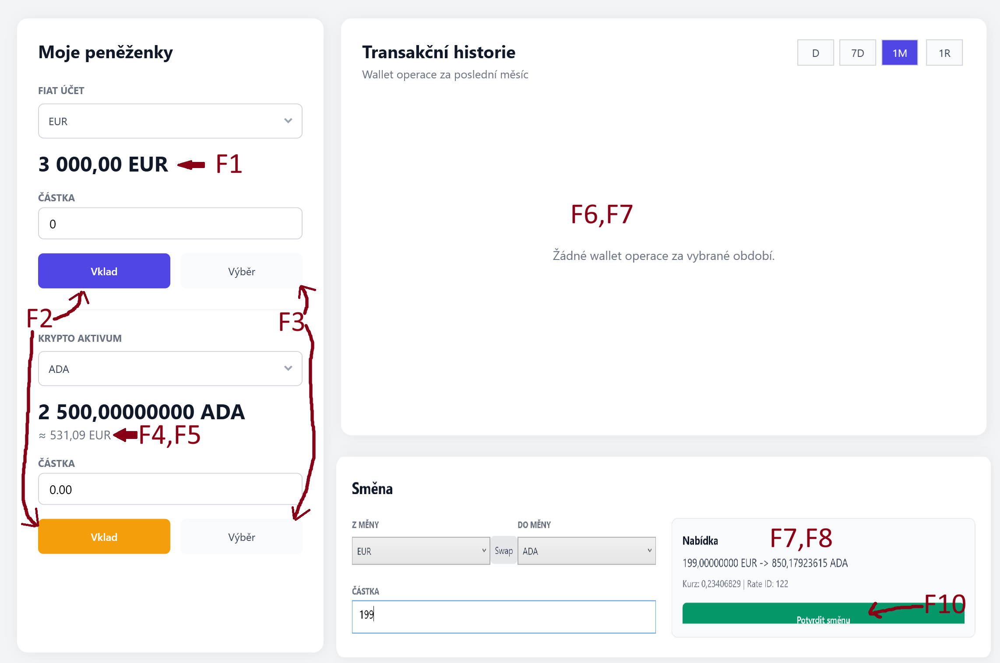

# Krypto směnárna

**Autor:** Samuel Kratoš
**Login:** KRA0745
**Předmět:** Databázové systémy 2
**GitHub:** https://github.com/chouspi/Krypto_smenarna/tree/main

## Specifikace programu

Primární úlohou tohoto programu je simulovat jednoduchou směnárnu kryptoměn.

Program umožňuje pracovat s uživatelskými účty, peněženkami a podporovanými měnami. Uživatel si může zobrazit své peněženky, provádět vklady a výběry a směňovat prostředky mezi fiat měnami a kryptoměnami.

Při směně si uživatel zvolí zdrojovou a cílovou měnu, zadá částku a program podle aktuálního kurzu vypočítá výslednou hodnotu směny.

Důležitou funkcí programu je také zobrazení historie transakcí, kde jsou evidovány provedené směny a peněženkové operace uživatele.

## Model

## Formulář

## Seznam funkcí

### CRUD F1 GetFiatBalance(p_user_id, p_fiat_code, p_balance)

Procedura vrátí zůstatek fiat peněženky daného uživatele.

**Vstupy**
  
`p_user_id` – ID uživatele  
`p_fiat_cod` – ID měny  
  
**Výstupy**
    
ÚSPĚCH - vrátí uživatelův zústatek  
Pokud uživatel danou fiat peněženku nemá, procedura vrátí hodnotu 0.

---

### T F2 DepositToWallet(p_user_id, p_currency_code, p_amount)

Transakce vloží prostředky do peněženky uživatele.

Podle zadaného kódu měny navýší zůstatek odpovídající peněženky a vloží záznam o provedeném vkladu do tabulky `wallet_operations`.

**Vstupy**

`p_user_id` – ID uživatele  
`p_currency_code` – kód měny  
`p_amount` – vkládaná částka  

**Chybové hlášky**

`-20001` – Částka musí být větší než 0.  

---

### T F3 WithdrawFromWallet(p_user_id, p_currency_code, p_amount)

Transakce provede výběr prostředků z peněženky uživatele.

Nejdříve ověří, že zadaná částka je větší než 0. Poté vyhledá odpovídající peněženku, zkontroluje dostatečný zůstatek, sníží zůstatek peněženky a vloží záznam o výběru do tabulky `wallet_operations`.

**Vstupy**

`p_user_id` – ID uživatele  
`p_currency_code` – kód měny  
`p_amount` – vybíraná částka  

**Chybové hlášky**

`-20002` – Částka musí být větší než 0.  
`-20003` – Nedostatečný zůstatek.    

---

### CRUD F4 FindTradingPair(p_base_currency_code, p_quote_currency_code, p_pair_id, p_is_reversed, p_message)

Procedura vyhledá obchodní pár podle zadaných měn.

Funkce umožňuje vyhledat pár i v opačném pořadí měn. Pokud je pár nalezen v opačném směru, nastaví výstupní parametr `p_is_reversed` na hodnotu 1. Pokud je pár nalezen ve stejném směru, nastaví hodnotu 0.

**Vstupy**

`p_base_currency_code` – kód první měny  
`p_quote_currency_code` – kód druhé měny  

**Výstupy**

`p_pair_id` – ID nalezeného obchodního páru  
`p_is_reversed` – informace, zda byl pár nalezen v opačném směru  

Pokud obchodní pár neexistuje, výstupní hodnoty se nastaví na `NULL`.

---

### CRUD F5 GetLatestExchangeRate(p_pair_id, p_rate_id, p_rate, p_valid_from, p_valid_to, p_is_valid)

Procedura vrátí poslední dostupný kurz pro zadaný obchodní pár.

Podle parametru `p_pair_id` vyhledá nejnovější kurz z tabulky `exchange_rates`. Zároveň určí, zda je tento kurz v aktuálním čase stále platný.

**Vstupy**

`p_pair_id` – ID obchodního páru  

**Výstupy**

`p_rate_id` – ID nalezeného kurzu  
`p_rate` – hodnota kurzu  
`p_valid_from` – začátek platnosti kurzu  
`p_valid_to` – konec platnosti kurzu  
`p_is_valid` – informace, zda je kurz aktuálně platný  

Pokud kurz neexistuje, výstupní hodnoty se nastaví na `NULL` a `p_is_valid` na hodnotu 0.

---

### CRUD F6 GetTransactionsForXDays(p_user_id, p_days)

Funkce vrátí historii transakcí uživatele za posledních `p_days` dní.

Výsledkem je společný přehled směn z tabulky `exchange_transactions` a samostatných peněženkových operací z tabulky `wallet_operations`. Záznamy jsou seřazeny od nejnovějších po nejstarší.

**Vstupy**

`p_user_id` – ID uživatele  
`p_days` – počet dní zpětně  

**Výstupy**

Funkce vrací kurzor se seznamem transakcí a operací. Výsledek obsahuje typ záznamu, čas operace, stav, měny, částky a případně použitý směnný kurz.

---

### CRUD F7 GetWalletOperationsForDays(p_user_id, p_days)

Funkce vrátí peněženkové operace uživatele za posledních `p_days` dní.

Používá se pro zobrazení historie vkladů, výběrů a operací spojených se směnou. Výsledek obsahuje informace o peněžence, měně, typu operace, částce a čase provedení.

**Vstupy**

`p_user_id` – ID uživatele  
`p_days` – počet dní zpětně  

**Výstupy**

Funkce vrací kurzor se seznamem peněženkových operací seřazených od nejnovějších po nejstarší.

---

### T F8 EnsureValidExchangeRate(p_pair_id, p_rate_id, p_rate, p_valid_from, p_valid_to)

Procedura zajistí, že pro zadaný obchodní pár existuje aktuálně platný kurz.

Nejdříve se pokusí najít platný kurz v tabulce `exchange_rates`. Pokud platný kurz neexistuje, vezme poslední dostupný kurz, ukončí jeho platnost a vytvoří nový kurz s krátkou časovou platností.

**Vstupy**

`p_pair_id` – ID obchodního páru  

**Výstupy**

`p_rate_id` – ID platného nebo nově vytvořeného kurzu  
`p_rate` – hodnota kurzu  
`p_valid_from` – začátek platnosti kurzu  
`p_valid_to` – konec platnosti kurzu  

---

### T F9 GetExchangeQuote(p_user_id, p_from_currency_code, p_to_currency_code, p_from_amount, p_pair_id, p_rate_id, p_exchange_rate, p_is_reversed, p_to_amount, p_message)

Procedura vypočítá nabídku směny pro uživatele.

Nejdříve ověří zadanou částku, existenci peněženek a to, že směna probíhá mezi fiat měnou a kryptoměnou. Poté zkontroluje dostatečný zůstatek, najde obchodní pár, zajistí platný kurz a vypočítá výslednou částku.

**Vstupy**

`p_user_id` – ID uživatele  
`p_from_currency_code` – kód zdrojové měny  
`p_to_currency_code` – kód cílové měny  
`p_from_amount` – částka ke směně  

**Výstupy**

`p_pair_id` – ID obchodního páru  
`p_rate_id` – ID použitého kurzu  
`p_exchange_rate` – použitý směnný kurz  
`p_is_reversed` – informace, zda je kurz použit opačně  
`p_to_amount` – výsledná částka po směně  
`p_message` – stavová zpráva  

**Chybové hlášky**

`-20004` – Částka musí být větší než 0.  
`-20005` – Směna musí být mezi fiat měnou a kryptoměnou.  
`-20006` – Nedostatečný zůstatek.  
`-20007` – Trading pair neexistuje.  
`-20008` – Výsledná částka je mimo povolený rozsah.  

---

---

### T F10 ExecuteExchange(p_user_id, p_from_currency_code, p_to_currency_code, p_from_amount, p_expected_rate_id, p_transaction_id, p_exchange_rate, p_to_amount, p_message)

Transakce provede směnu mezi dvěma peněženkami uživatele.

Jedná se o hlavní netriviální funkci formuláře, protože pracuje s více propojenými tabulkami. Při provedení směny se využívají tabulky `users`, `wallets`, `currencies`, `trading_pairs`, `exchange_rates`, `exchange_transactions` a `wallet_operations`.

Procedura nejdříve ověří vstupní částku a upraví kódy měn do jednotného formátu. Poté vyhledá zdrojovou i cílovou peněženku uživatele a obě peněženky uzamkne pro změnu zůstatku. Tím se zabrání nekonzistentnímu stavu při současném provádění více transakcí.

Dále se ověří, že směna probíhá mezi fiat měnou a kryptoměnou. Není tedy povolena směna fiat-fiat ani crypto-crypto. Následně se kontroluje, zda má zdrojová peněženka dostatečný zůstatek pro provedení směny.

Poté procedura vyhledá odpovídající obchodní pár pomocí funkce `FindTradingPair`. Pokud obchodní pár existuje, zajistí se aktuálně platný směnný kurz pomocí funkce `EnsureValidExchangeRate`. Podle toho, zda byl obchodní pár nalezen v přímém nebo opačném směru, se výsledná částka vypočítá buď násobením, nebo dělením kurzem.

Po úspěšném výpočtu se vytvoří záznam o směně v tabulce `exchange_transactions`. Následně se odečte směňovaná částka ze zdrojové peněženky a přičte se vypočítaná částka do cílové peněženky. Nakonec se do tabulky `wallet_operations` vloží dvě operace: jedna pro odchozí částku a druhá pro příchozí částku.

Pokud celý proces proběhne bez chyby, transakce se potvrdí pomocí `COMMIT`. Pokud nastane jakákoliv chyba, všechny provedené změny se zruší pomocí `ROLLBACK`.

**Vstupy**

`p_user_id` – ID uživatele  
`p_from_currency_code` – kód zdrojové měny  
`p_to_currency_code` – kód cílové měny  
`p_from_amount` – směňovaná částka  
`p_expected_rate_id` – očekávané ID kurzu  

**Výstupy**

`p_transaction_id` – ID vytvořené směnné transakce  
`p_exchange_rate` – použitý směnný kurz  
`p_to_amount` – výsledná částka v cílové měně  
`p_message` – stavová zpráva  

**Výstupy transakce**

ÚSPĚCH – vytvoření záznamu o směně, úprava zůstatků obou peněženek a vložení dvou peněženkových operací  

NEÚSPĚCH – zrušení celé transakce pomocí rollbacku  

**Chybové hlášky**

`-20009` – Částka musí být větší než 0.  
`-20010` – Směna musí být mezi fiat měnou a kryptoměnou.  
`-20011` – Nedostatečný zůstatek.  
`-20012` – Trading pair neexistuje.  
`-20014` – Výsledná částka je mimo povolený rozsah.  

