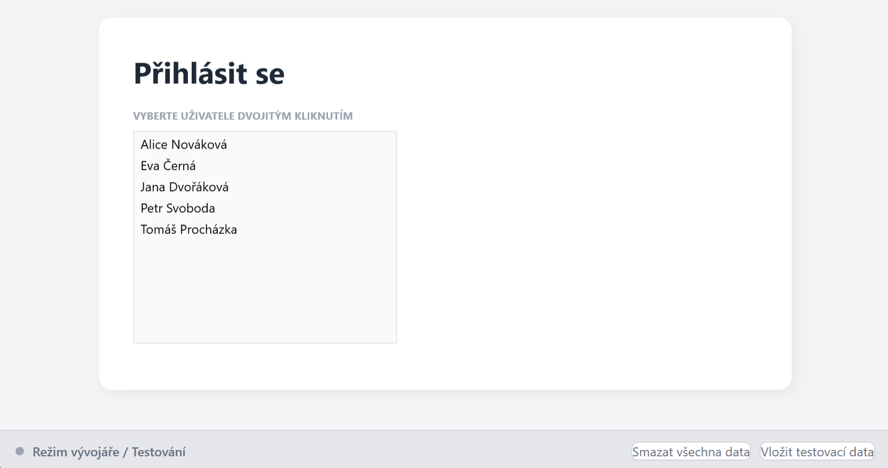
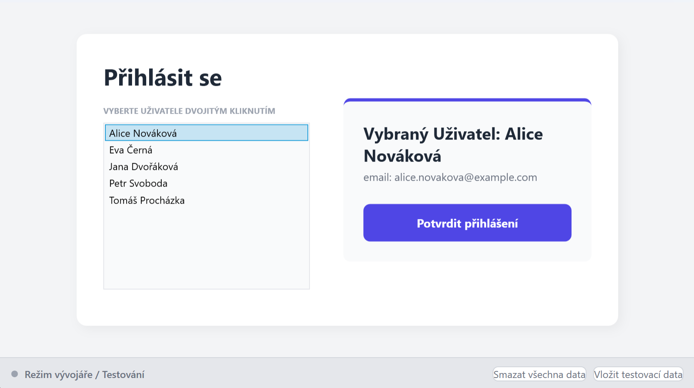
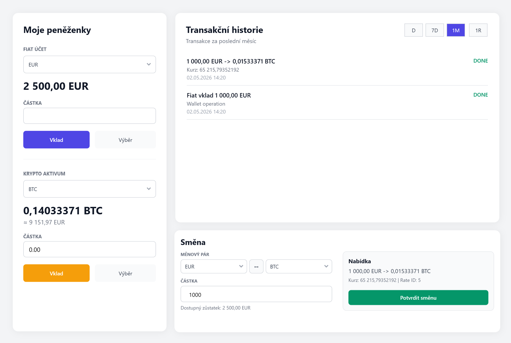

# Crypto Exchange


Simulation of a simple cryptocurrency exchange as a desktop WPF application. The user selects an account, manages fiat and crypto wallets, deposits and withdraws funds, exchanges assets using the current database exchange rate, and reviews transaction history. Data is stored in an Oracle database started through Docker Compose, and key balance-changing operations are handled by database procedures.

## Used Technologies

- C# and .NET 9
- WPF for the desktop user interface
- Oracle Database Free running in Docker
- Oracle PL/SQL procedures and functions
- `Oracle.ManagedDataAccess.Core` for database access
- Docker Compose for local database startup

## How to Run

Requirements:

- Windows
- .NET 9 SDK
- Docker Desktop

Start the project setup from the repository root:

```powershell
.\setup.ps1
```

The script creates `.env` from `.env.example` if needed, starts Oracle with Docker Compose, waits until the database is ready, and runs all SQL scripts from `db/init`.

Default database credentials from `.env.example`:

- application user: `APP`
- application password: `AppTest123`
- Oracle admin password: `OracleTest123`

Restore and run the WPF application:

```powershell
dotnet restore Krypto_smenarna.sln
dotnet run --project src/KryptoSmenarna.Wpf/KryptoSmenarna.Wpf.csproj
```

After the first database startup, use the `Vložit testovací data` button in the application to insert test users, wallets, currencies, and exchange rates.

## Features

The application starts with a simple user selection screen. test data can also be inserted or deleted directly from this window.



After selecting a user by double clicking, the application displays a confirmation panel with basic account information before opening the dashboard.



The main dashboard combines wallet management, transaction history, and exchange operations in one screen.



Main supported features:

- fiat and crypto wallet overview
- fiat and crypto deposits through Oracle stored procedure `DepositToWallet`
- fiat and crypto withdrawals through Oracle stored procedure `WithdrawFromWallet`
- fiat-to-crypto and crypto-to-fiat exchange through Oracle stored procedure `ExecuteExchange`
- automatic quote calculation when the amount or selected currencies change
- transaction history with time range filters
- exchange rates loaded from Oracle and refreshed automatically after expiration

## Configuration

The repository does not include `.env`, because it contains local database credentials. If you do not use `setup.ps1`, create it from the provided example:

```powershell
Copy-Item .env.example .env
```

Default values in `.env.example`:

```env
ORACLE_PASSWORD=OracleTest123
APP_USER=APP
APP_USER_PASSWORD=AppTest123
```

On startup, the application searches for `.env` from the application output directory up to the project root.

## Database Setup

Start the database with Docker Compose manually:

```powershell
docker compose up -d
```

Oracle runs on port `1521`, and initialization SQL scripts are loaded from `db/init`.

If a Docker volume already exists and the initialization scripts need to run again, recreate the database:

```powershell
docker compose down -v
docker compose up -d
```

This deletes the local database data.

## Project Structure

```text
Krypto_smenarna/
|- db/
|  |- init/    database tables, procedures, and indexes
|  `- test/    scripts for inserting and deleting test data
|- docs/       notes and school project analysis
|- src/
|  `- KryptoSmenarna.Wpf/
|     |- Data/             database access and tools
|     |- Models/           classes representing db tables
|     `- UserSubWindows/   wallet, transaction history and exchange UI sections
|- compose.yaml
`- Krypto_smenarna.sln
```

## Main User Window

`UserWindow` is a dashboard shell. It hosts three WPF user controls from `UserSubWindows`:

- `WalletOperationsSubWindow` contains the implemented fiat/crypto deposit and withdrawal form.
- `TransactionHistorySubWindow` displays wallet operations and exchange transactions with time range filters.
- `ExchangeSubWindow` handles fiat-to-crypto and crypto-to-fiat exchange with automatic quote calculation.

The dashboard layout keeps wallets on the left side and places transaction history above exchange on the right side.

## Database Scripts

- `db/init/01_dbInit.sql` creates the base tables and indexes.
- `db/init/F1_GetFiatBalance.sql` returns a user's fiat balance.
- `db/init/F2_DepositToWallet.sql` deposits funds into a wallet.
- `db/init/F3_WithdrawFromWallet.sql` withdraws funds from a wallet.
- `db/init/F4_FindTrafingPair.sql` finds a trading pair in both currency directions.
- `db/init/F5_GetLastExchangeRate.sql` returns the latest known exchange rate.
- `db/init/F6_GetTransactionFroXDays.sql` returns exchange transactions and wallet operations for a selected time range.
- `db/init/F7_GetWalletOperationsForDays.sql` returns wallet operations for a selected time range.
- `db/init/F8_EnsureValidExchangeRate.sql` returns a valid exchange rate or creates a new simulated one.
- `db/init/F9_GetExchangeQuote.sql` calculates an exchange quote.
- `db/init/F10_ExecuteExchange.sql` executes an exchange and writes linked wallet operations.
- `db/test/insertRestValues.sql` inserts test users, currencies, wallets, and exchange rates.
- `db/test/deleteAllData.sql` deletes test data.

## Notes

- `.env` is ignored by git and must exist locally.
- The application uses the Oracle connection target `localhost:1521/FREEPDB1`.
- The project uses `Oracle.ManagedDataAccess.Core`.

